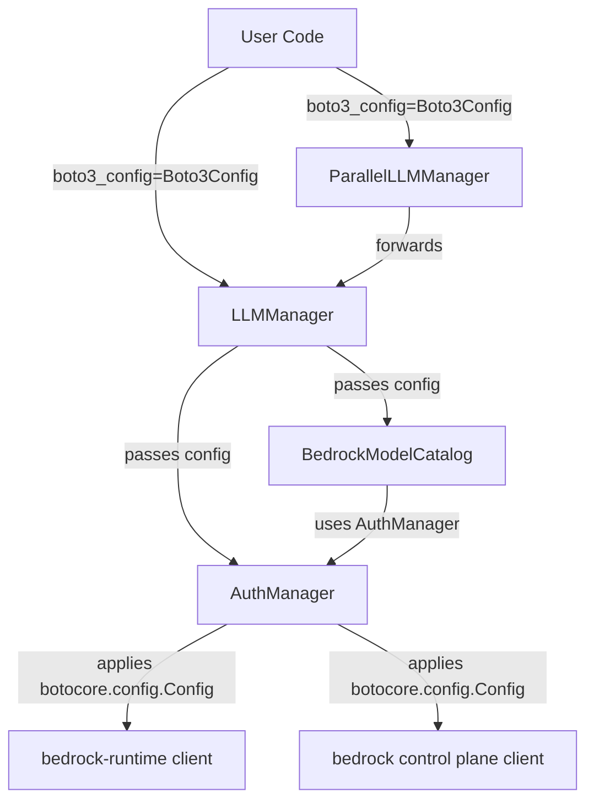
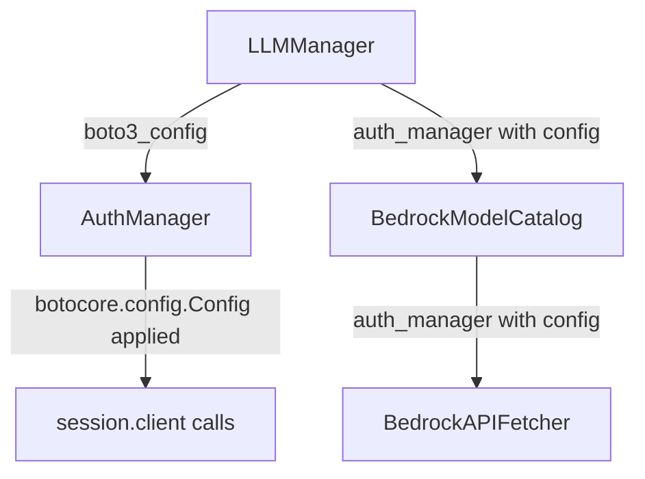

# Design Document: Boto3 Timeout Configuration

## Overview

This feature introduces a `Boto3Config` frozen dataclass that encapsulates boto3 client-level settings (read timeout, connect timeout, connection pooling, retries) with Bedrock-optimized defaults. The config is accepted as an optional parameter in `LLMManager` and `ParallelLLMManager` constructors, propagated through `AuthManager` to all boto3 client creation points, and also forwarded to `BedrockModelCatalog` for its internal API calls.

When no `Boto3Config` is provided (`None`), a default instance is created automatically, giving all users the Bedrock-optimized 600-second read timeout without code changes.

## Architecture

The config flows through the existing component hierarchy without altering the current architecture:



Key design decisions:
1. `Boto3Config` lives in `llm_manager_structures.py` alongside existing config dataclasses (`AuthConfig`, `RetryConfig`) — it follows the same pattern and is part of the same configuration surface.
2. `AuthManager` receives the `Boto3Config` in its constructor and converts it to a `botocore.config.Config` once, reusing it for all client creation calls.
3. `BedrockModelCatalog` receives the `Boto3Config` and passes it to its internal `BedrockAPIFetcher`, which in turn passes it to `AuthManager` calls.
4. Validation happens at construction time in `Boto3Config.__post_init__` (value range checks) and in `LLMManager.__init__` (type check).

## Components and Interfaces

### 1. Boto3Config (new dataclass)

Location: `src/bestehorn_llmmanager/bedrock/models/llm_manager_structures.py`

```python
@dataclass(frozen=True)
class Boto3Config:
    """Configuration for boto3 client behavior with Bedrock-optimized defaults."""

    read_timeout: int = 600
    connect_timeout: int = 60
    max_pool_connections: int = 10
    retries_max_attempts: int = 3

    def __post_init__(self) -> None:
        """Validate all fields are within acceptable ranges."""
        ...

    def to_botocore_config(self) -> "botocore.config.Config":
        """Convert to botocore.config.Config for use in session.client() calls."""
        ...
```

### 2. AuthManager (modified)

Location: `src/bestehorn_llmmanager/bedrock/auth/auth_manager.py`

Changes:
- Constructor accepts optional `boto3_config: Optional[Boto3Config] = None`
- Stores the converted `botocore.config.Config` instance (or `None`)
- `get_bedrock_client()` passes `config=` to `session.client()`
- `get_bedrock_control_client()` passes `config=` to `session.client()`

### 3. LLMManager (modified)

Location: `src/bestehorn_llmmanager/llm_manager.py`

Changes:
- Constructor accepts `boto3_config: Optional[Boto3Config] = None`
- Validates type if not `None`
- Creates default `Boto3Config()` when `None`
- Passes to `AuthManager` constructor
- Passes to `BedrockModelCatalog` constructor

### 4. ParallelLLMManager (modified)

Location: `src/bestehorn_llmmanager/parallel_llm_manager.py`

Changes:
- Constructor accepts `boto3_config: Optional[Boto3Config] = None`
- Forwards to internal `LLMManager` constructor

### 5. BedrockModelCatalog (modified)

Location: `src/bestehorn_llmmanager/bedrock/catalog/bedrock_catalog.py`

Changes:
- Constructor accepts optional `boto3_config: Optional[Boto3Config] = None`
- Passes to `BedrockAPIFetcher` constructor

### 6. BedrockAPIFetcher (modified)

Location: `src/bestehorn_llmmanager/bedrock/catalog/api_fetcher.py`

Changes:
- Constructor accepts optional `boto3_config: Optional[Boto3Config] = None`
- Stores the config
- When calling `self._auth_manager.get_bedrock_control_client()`, the config is already applied via `AuthManager` — no changes needed in fetcher call sites if `AuthManager` is shared

Note: Since `BedrockModelCatalog` already receives an `AuthManager` instance from `LLMManager`, and that `AuthManager` already has the `Boto3Config` applied, the `BedrockAPIFetcher` inherits the config automatically through the shared `AuthManager`. No separate propagation path is needed in `BedrockAPIFetcher` — the `AuthManager` is the single point of config application.

Revised propagation: `BedrockModelCatalog` and `BedrockAPIFetcher` do not need their own `boto3_config` parameter. They use the `AuthManager` instance that already has the config. This simplifies the design.



## Data Models

### Boto3Config

```python
@dataclass(frozen=True)
class Boto3Config:
    read_timeout: int = 600          # Bedrock-optimized (boto3 default: 60)
    connect_timeout: int = 60        # Matches boto3 default
    max_pool_connections: int = 10   # Matches boto3 default
    retries_max_attempts: int = 3    # Matches boto3 default
```

### Conversion to botocore.config.Config

```python
def to_botocore_config(self) -> botocore.config.Config:
    return botocore.config.Config(
        read_timeout=self.read_timeout,
        connect_timeout=self.connect_timeout,
        max_pool_connections=self.max_pool_connections,
        retries={"max_attempts": self.retries_max_attempts},
    )
```

The `retries` parameter is wrapped in a dict because `botocore.config.Config` expects it as `{"max_attempts": value}` to support multiple retry options (`max_attempts` and `mode`).

### Validation Rules

| Field | Type | Valid Range | Error |
|-------|------|-------------|-------|
| `read_timeout` | `int` | > 0 | `ValueError` |
| `connect_timeout` | `int` | > 0 | `ValueError` |
| `max_pool_connections` | `int` | > 0 | `ValueError` |
| `retries_max_attempts` | `int` | >= 0 | `ValueError` |

### Type Validation in LLMManager

When `boto3_config` is provided and is not `None`, `LLMManager.__init__` checks `isinstance(boto3_config, Boto3Config)`. If it fails, a `ConfigurationError` is raised with a descriptive message.


## Correctness Properties

*A property is a characteristic or behavior that should hold true across all valid executions of a system — essentially, a formal statement about what the system should do. Properties serve as the bridge between human-readable specifications and machine-verifiable correctness guarantees.*

### Property 1: Boto3Config to botocore.config.Config round-trip preservation

*For any* valid `Boto3Config` instance (with positive timeouts, positive pool connections, and non-negative retries), converting it via `to_botocore_config()` should produce a `botocore.config.Config` where `read_timeout`, `connect_timeout`, and `max_pool_connections` match the original values, and `retries` is a dict `{"max_attempts": retries_max_attempts}`.

**Validates: Requirements 1.6, 1.7**

### Property 2: Positive-value field validation rejects non-positive values

*For any* non-positive integer (zero or negative) assigned to `read_timeout`, `connect_timeout`, or `max_pool_connections`, constructing a `Boto3Config` should raise a `ValueError`.

**Validates: Requirements 4.2, 4.3, 4.4**

### Property 3: Negative retries validation

*For any* negative integer assigned to `retries_max_attempts`, constructing a `Boto3Config` should raise a `ValueError`. Zero is valid (disables retries).

**Validates: Requirements 4.5**

### Property 4: Invalid type rejection in LLMManager

*For any* value that is not an instance of `Boto3Config` and is not `None` (e.g., strings, integers, dicts, lists), passing it as `boto3_config` to `LLMManager` should raise a `ConfigurationError`.

**Validates: Requirements 4.1**

## Error Handling

| Scenario | Exception | Raised By |
|----------|-----------|-----------|
| `boto3_config` is not `Boto3Config` or `None` | `ConfigurationError` | `LLMManager.__init__` |
| `read_timeout <= 0` | `ValueError` | `Boto3Config.__post_init__` |
| `connect_timeout <= 0` | `ValueError` | `Boto3Config.__post_init__` |
| `max_pool_connections <= 0` | `ValueError` | `Boto3Config.__post_init__` |
| `retries_max_attempts < 0` | `ValueError` | `Boto3Config.__post_init__` |

All validation errors are raised at construction time (fail-fast). No silent fallbacks or default substitutions for invalid values.

## Testing Strategy

### Property-Based Tests (hypothesis)

Each correctness property maps to a single hypothesis test. Minimum 100 examples per test.

- **Property 1**: Generate random valid `Boto3Config` instances (positive ints for timeouts/pool, non-negative int for retries). Assert all fields round-trip through `to_botocore_config()`.
  - Tag: `Feature: boto3-timeout-config, Property 1: round-trip preservation`
- **Property 2**: Generate random non-positive integers. For each of `read_timeout`, `connect_timeout`, `max_pool_connections`, assert `ValueError` is raised.
  - Tag: `Feature: boto3-timeout-config, Property 2: positive-value validation`
- **Property 3**: Generate random negative integers for `retries_max_attempts`. Assert `ValueError` is raised.
  - Tag: `Feature: boto3-timeout-config, Property 3: negative retries validation`
- **Property 4**: Generate random non-`Boto3Config` values (strings, ints, dicts, floats). Assert `ConfigurationError` is raised when passed to `LLMManager`. This test requires mocking `AuthManager` and `BedrockModelCatalog` to isolate the type check.
  - Tag: `Feature: boto3-timeout-config, Property 4: invalid type rejection`

### Unit Tests (pytest)

Unit tests cover specific examples, defaults, and integration wiring:

- Default `Boto3Config()` has `read_timeout=600`, `connect_timeout=60`, `max_pool_connections=10`, `retries_max_attempts=3`
- `Boto3Config` is frozen (assignment raises `FrozenInstanceError`)
- `to_botocore_config()` returns a `botocore.config.Config` instance
- `AuthManager` passes `config=` to `session.client("bedrock-runtime", ...)` when `Boto3Config` is provided
- `AuthManager` passes `config=` to `session.client("bedrock", ...)` when `Boto3Config` is provided
- `AuthManager` does not pass `config=` when no `Boto3Config` is provided (backward compat)
- `LLMManager` creates default `Boto3Config` when `boto3_config=None`
- `ParallelLLMManager` forwards `boto3_config` to internal `LLMManager`
- `BedrockModelCatalog` receives config through shared `AuthManager`

### Test Library

- Property-based testing: `hypothesis` (already in project dependencies)
- Unit testing: `pytest` with `unittest.mock` for mocking boto3 sessions and clients

### Test File Location

- `test/bestehorn_llmmanager/bedrock/models/test_boto3_config.py` — Boto3Config unit + property tests
- `test/bestehorn_llmmanager/bedrock/auth/test_auth_manager_boto3_config.py` — AuthManager config propagation tests
- `test/bestehorn_llmmanager/test_LLMManager_boto3_config.py` — LLMManager integration tests
- `test/bestehorn_llmmanager/test_ParallelLLMManager_boto3_config.py` — ParallelLLMManager forwarding tests
